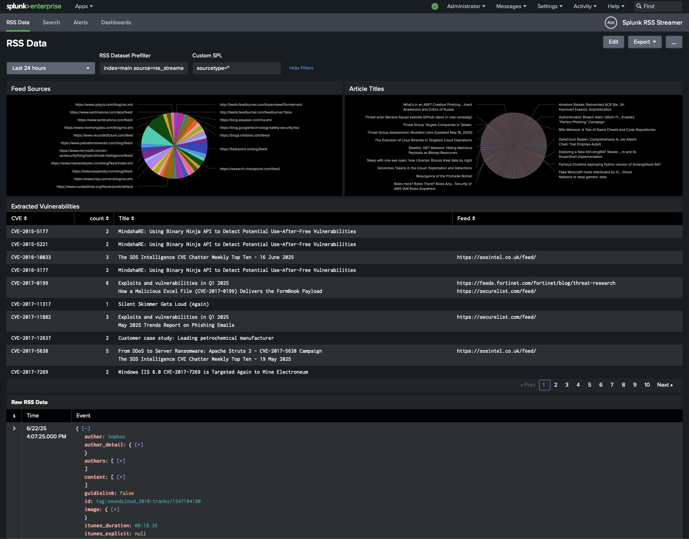
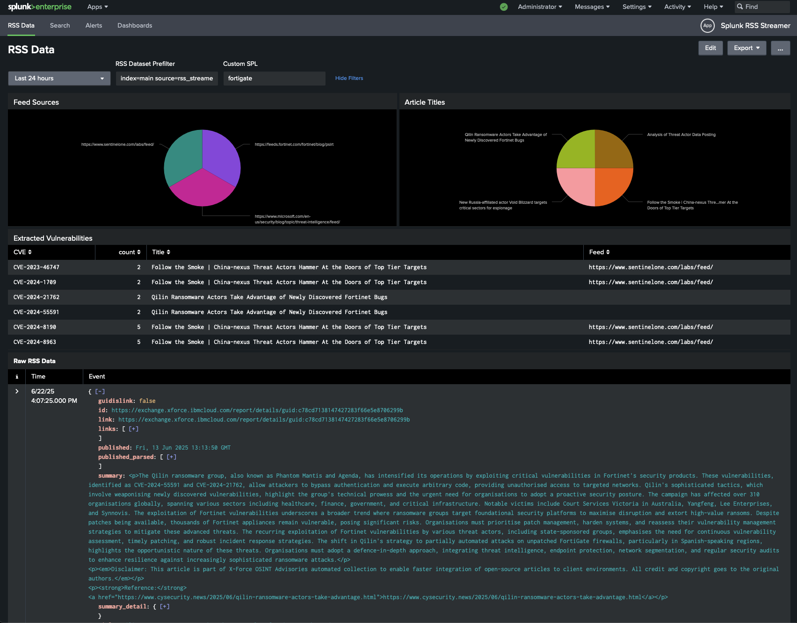
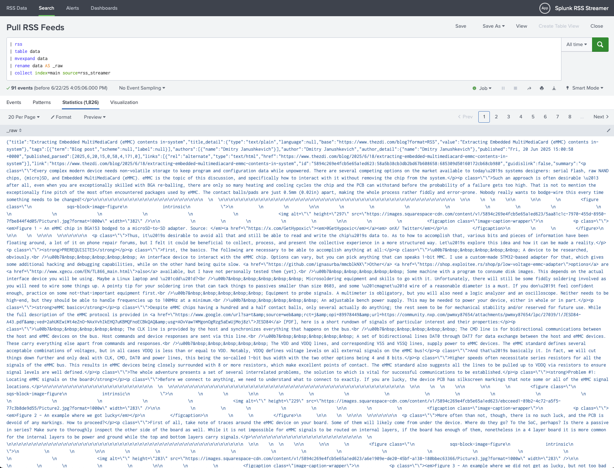
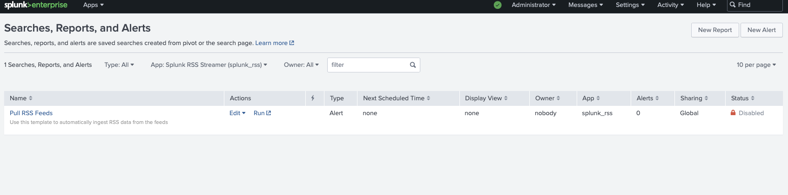

# Splunk RSS Streamer
This app is something I developed for my personal environment to keep tabs on OSINT data. It consists of a custom `rss` command to pull data from the feeds specified in the `rss.py` python file and a dashboard to visualize and search the data. By retrieving the RSS content and collecting it to a stash index, you can easily run custom alerting over the data looking for keywords of interest such as vendors you use or your company name. 

I included a scheduled search that automatically updates the RSS feed data every four hours, this is disabled by default but you can enable it once you have added any additional RSS sources you want in the sources list. 

The app ships with more than a few out-of-the-box RSS sources I keep tabs on personally but you can add/remove items as you see fit.

---
# Demo

The above screenshot shows the app's main dashboard that shows basic information about the collected RSS data and provides an easy mechanism to search it.

---

Here, a simple query for "fortigate" is run in the dashboard to quickly show relevant data

---

The app's `| rss` command can be run manually to pull fresh data from the feeds. The `collect` command is then used to save the results to a stash index for later review.

---

The app includes a scheduled search that will automatically update the feed data every four hours. Before enabling this be sure to add or remove any sources you want to in `rss.py` and verify the index `collect` is set to use is the one desired.

Happy Hunting :)
